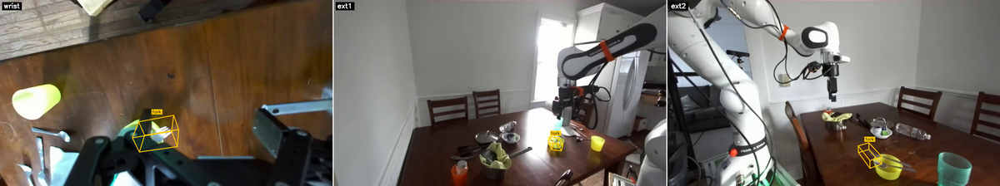

# WildDet3D Embodied (DROID) Demo

WildDet3D finetuned on [DROID](https://droid-dataset.github.io/) for
open-vocabulary 3D detection of robot-manipulation objects across three
camera views (wrist + ext1 + ext2). This demo covers:

- The Stage-4 DROID finetune training recipe
  (`configs/training/stage4_droid_ft.py`).
- The DROID evaluation benchmark with 4 mode configs (text / oracle ×
  monocular / GT depth), under `configs/eval/droid/`.
- A triple-camera prediction renderer (this directory's
  `render_triple.py`).
- Data conversion scripts to build the DROID Omni3D-style annotation
  JSON from our single-frame box pipeline output, under
  `scripts/data_prep/droid/`.

<p align="center">
  
</p>

## Pipeline

```
DROID raw episodes  ──Step 1──>  Per-episode VLM + depth +    ──Step 2──>  Omni3D-style       ──Step 3──>  Stage 4 finetune       ──Step 4──>  4-mode eval
(droid_raw/1.0.1)                box pipeline outputs                       DROID_train.json +              from Stage 3 ckpt                   on DROID val
                                 (step1/2a/2b/3b1)                          DROID_val.json
                                                                            (multi-view, ~24k samples)
```

Steps 1 and 2 are documented in `scripts/data_prep/droid/README.md`.
Steps 3 and 4 use the standard WildDet3D `vis4d fit` / `vis4d test` CLI
with the configs listed below.

## Checkpoint

| Recipe | Notes | Download |
|--------|-------|----------|
| WildDet3D-Embodied (Stage 4) | DROID + Omni3D mix finetune from Stage 3, canonical rotation, 3 epochs, lr=1e-4, ~73K training samples per epoch | `huggingface-cli download weikaih/WildDet3D-Embodied wilddet3d_embodied_stage4.pt --local-dir ckpt/` |

The checkpoint is the same `inference_only.ckpt` produced by Stage 4
training; it contains only model weights (no optimizer / scheduler
state) so it is ~4.7 GB instead of ~8.7 GB. Use this for inference /
eval; for resuming or further finetuning, train from a Stage 3 ckpt
instead.

## Quick Start

### 1. Prepare DROID data

See `scripts/data_prep/droid/README.md` for the full conversion
workflow. In short:

```bash
# Convert pipeline outputs -> Omni3D-style JSON (+ per-view JPEGs + uint16-mm PNG depth)
python scripts/data_prep/droid/convert_droid_to_omni3d.py \
    --box_dir       <pipeline_output>/step3b1_singleframe_box \
    --depth_h5_dir  <pipeline_output>/step2a_depth \
    --step2b_dir    <pipeline_output>/step2b_extrinsics \
    --vlm_dir       <pipeline_output>/step1_vlm_results \
    --droid_raw_root <droid_raw>/1.0.1 \
    --out_dir       data/droid \
    --num_workers   64

# Build the unified-category val (DROID_val_unified.json)
python scripts/data_prep/droid/build_unified_val.py --droid_dir data/droid

# HDF5-pack for fast distributed IO
python -m vis4d.data.io.to_hdf5 -p data/droid/data
python -m vis4d.data.io.to_hdf5 -p data/droid/depth
```

We also publish the converted DROID benchmark val JSON +
`DROID_val_unified.json` on Hugging Face for users who don't need to
regenerate from the pipeline:

```bash
huggingface-cli download weikaih/WildDet3D-Embodied-Benchmark \
    DROID_val.json DROID_val_unified.json --local-dir data/droid/annotations
```

### 2. Evaluate on DROID

Four mode configs are provided in `configs/eval/droid/`:

| Config | Prompt | Depth | Notes |
|--------|--------|-------|-------|
| `text.py` | text (open vocabulary) | monocular (LingBot-Depth) | Main "in-the-wild" setting |
| `text_with_depth.py` | text | GT depth (FoundationStereo) | Upper bound when depth is given |
| `oracle.py` | oracle 2D boxes | monocular | Isolates 2D->3D lifting quality |
| `oracle_with_depth.py` | oracle 2D boxes | GT depth | Cleanest geometry-only signal |

```bash
vis4d test --config configs/eval/droid/text.py \
    --gpus 1 --ckpt ckpt/wilddet3d_embodied_stage4.pt
```

Each config evaluates against `DROID_val_unified.json` (210 -> 146
categories, head-noun unification) and reports a Base / Novel split
based on the 45 single-word frequent target categories
(>=50 samples in train+val combined).

### 3. Visualize predictions across 3 cameras

`render_triple.py` reads vis4d's saved `detect_3D_results.json` and
projects the predicted 3D boxes onto each of the three camera views
side-by-side:

```bash
python demo/embodied/render_triple.py \
    --episode shard00020_ep004 \
    --pred <eval_output>/eval/droid_dist/3D/detect_3D_results.json \
    --score_thresh 0.2
```

Add `--show_gt` to overlay ground-truth boxes in white for comparison.
Output is written under `demo/embodied/output/`.

### 4. Retrain the Stage 4 DROID finetune

```bash
vis4d fit --config configs/training/stage4_droid_ft.py \
    --gpus 8 \
    --ckpt <stage3_checkpoint.pt>
```

Stage 4 keeps Omni3D in the mix (70%) and adds DROID at 30%, with
DROID driving the epoch length (so 1 epoch = ~22K DROID samples seen
once, ~73K total samples). The base learning rate is 1e-4. See the
config's module docstring for full hyperparameters.

## Source repositories

| Component | Origin |
|-----------|--------|
| Detection model | This repo (WildDet3D, finetuned for DROID) |
| Dataset (raw episodes) | [DROID](https://droid-dataset.github.io/) (Khazatsky et al., 2024) |
| Per-episode 3D box pipeline | This repo, internal pipeline (see `scripts/data_prep/droid/README.md` for the expected output schema) |
| Depth | [FoundationStereo](https://github.com/NVlabs/FoundationStereo) (Wen et al., 2024) — uint16 mm |

## Citation

If you use the embodied checkpoint or the DROID benchmark, please cite
both WildDet3D and DROID:

```bibtex
@article{huang2025wilddet3d,
  title={WildDet3D: Scaling Promptable 3D Detection in the Wild},
  author={Huang, Weikai and Zhang, Jieyu and others},
  year={2025}
}

@inproceedings{khazatsky2024droid,
  title={{DROID}: A Large-Scale In-the-Wild Robot Manipulation Dataset},
  author={Khazatsky, Alexander and others},
  booktitle={Robotics: Science and Systems (RSS)},
  year={2024}
}
```
